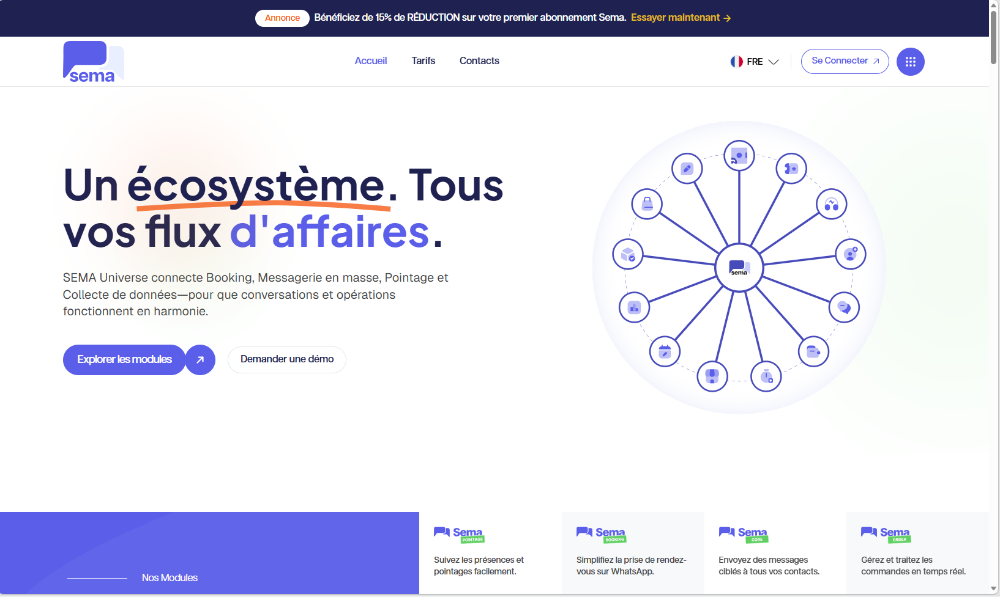
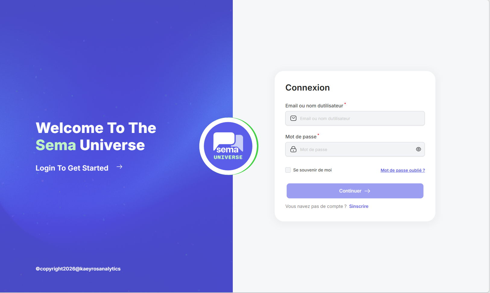
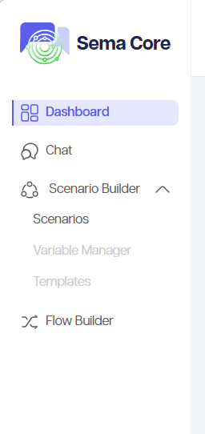

Premiers pas et authentification
================================

Cette section explique comment accéder à Sema Universe, se connecter à Sema Core et reconnaître les premiers éléments de l'interface.

Étape 1 — Accéder à la plateforme
--------------------------------

**1.** Ouvrez votre navigateur.

**2.** Saisissez l'adresse de la plateforme : https://dashboard.dev.sem-a.com/fr.

**3.** Vérifiez que la page de connexion ou la page d'accueil Sema Universe s'affiche.

Étape 2 — Se connecter
--------------------------------

**1.** Cliquez sur **Se connecter** si vous arrivez sur la page publique ou la page d'accueil.

**2.** Renseignez votre adresse e-mail ou votre identifiant.

**3.** Renseignez votre mot de passe.

**4.** Validez le formulaire.

**5.** Si une vérification supplémentaire est demandée, suivez les instructions affichées.

   Ajoutez ici une capture du formulaire de connexion.

Étape 3 — Identifier l'espace de travail
--------------------------------

Après connexion, vérifiez :

- Le nom de l'espace de travail ;
- Le produit actif, par exemple **Sema Core** ;
- Les modules visibles dans le menu ;
- Votre profil utilisateur ;
- La langue de l'interface.

.. figure:: ../_images/bienvenu.png
   :alt: Capture à insérer de l'espace connecté Sema Core
   :width: 90%

Étape 4 — Comprendre le menu
--------------------------------

Le menu peut afficher plusieurs modules selon votre profil :

- **Tableau de bord** : statistiques et indicateurs ;
- **Chats** : conversations;
- **Scenario builder** : création de scénarios ;
- **Flow builder** : création de flows ;
- **Paramètres** : gestion de l'espace de travail.

Problèmes fréquents de connexion
--------------------------------

**1. Mot de passe incorrect**

Vérifiez que le mot de passe est saisi correctement. Si la fonctionnalité existe, utilisez le lien de réinitialisation. Sinon, contactez l'administrateur de votre espace de travail.

**2. Compte non reconnu**

Assurez-vous d'utiliser l'adresse e-mail liée à votre compte Sema. Si vous avez reçu une invitation, vérifiez que vous avez bien finalisé l'activation du compte.

**3. Module invisible**

Si un module attendu n'apparaît pas, demandez à l'administrateur de vérifier votre rôle et vos permissions.

Bon à savoir
------------

.. important::

   Ne partagez jamais votre mot de passe. Si vous utilisez un ordinateur partagé, déconnectez-vous après votre session.
