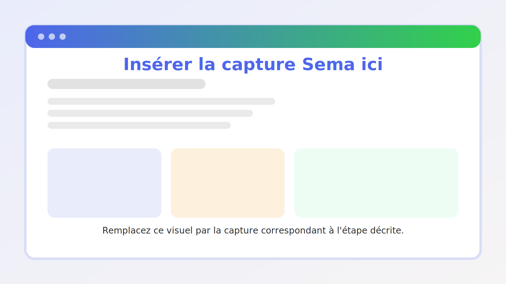

Guide pratique de configuration Sema Core
=========================================

Ce guide décrit l'ordre recommandé pour préparer un espace Sema Core avant utilisation par les équipes.

Étape 1 — Vérifier l'accès administrateur
=========================================

1. Connectez-vous avec un compte administrateur.
2. Vérifiez que le module **Paramètres** est visible.
3. Vérifiez que vous pouvez accéder aux utilisateurs, intégrations et modules Sema Core.

Capture à insérer — Accès administrateur
----------------------------------------

   Ajoutez ici une capture montrant les menus accessibles à l'administrateur.

Étape 2 — Configurer les informations de base
=============================================

1. Ouvrez les paramètres généraux.
2. Vérifiez le nom de l'organisation.
3. Vérifiez la langue principale.
4. Vérifiez le fuseau horaire.
5. Enregistrez les informations.

Capture à insérer — Paramètres généraux
---------------------------------------

   Ajoutez ici une capture des paramètres généraux.

Étape 3 — Ajouter les utilisateurs
==================================

1. Ouvrez **Paramètres > Utilisateurs**.
2. Cliquez sur **Ajouter un utilisateur**.
3. Renseignez les informations du compte.
4. Choisissez le rôle.
5. Enregistrez.
6. Demandez à l'utilisateur de tester sa connexion.

Capture à insérer — Utilisateurs
--------------------------------

   Ajoutez ici une capture de la liste des utilisateurs.

Étape 4 — Préparer les contacts
===============================

1. Ouvrez **Contacts**.
2. Vérifiez les contacts existants.
3. Préparez le fichier d'import si nécessaire.
4. Importez les contacts.
5. Corrigez les erreurs de format.
6. Testez la recherche d'un contact.

Capture à insérer — Préparation contacts
----------------------------------------

   Ajoutez ici une capture de l'import ou de la liste des contacts.

Étape 5 — Préparer le catalogue
===============================

1. Ouvrez **Catalogue**.
2. Créez les catégories.
3. Ajoutez les produits.
4. Vérifiez les images et descriptions.
5. Testez l'affichage dans un scénario.

Capture à insérer — Préparation catalogue
-----------------------------------------

   Ajoutez ici une capture des catégories ou produits.

Étape 6 — Créer un scénario de test
===================================

1. Ouvrez **Scenario Builder**.
2. Créez un scénario simple.
3. Ajoutez un message d'accueil.
4. Ajoutez une question.
5. Enregistrez la réponse dans une variable.
6. Ajoutez une condition.
7. Connectez les sorties.
8. Testez le scénario avec un contact de test.

Capture à insérer — Scénario de test
------------------------------------

   Ajoutez ici une capture d'un scénario simple sur le canvas.

Étape 7 — Créer une campagne pilote
===================================

1. Ouvrez **Messages en masse**.
2. Créez une campagne de test.
3. Sélectionnez un petit groupe de contacts.
4. Préparez le message.
5. Envoyez la campagne.
6. Vérifiez les résultats.

Capture à insérer — Campagne pilote
-----------------------------------

   Ajoutez ici une capture de la campagne pilote.

Étape 8 — Valider avec les utilisateurs
=======================================

1. Demandez à chaque rôle de tester ses accès.
2. Vérifiez que les agents peuvent traiter les conversations.
3. Vérifiez que les créateurs peuvent modifier les scénarios si nécessaire.
4. Vérifiez que les responsables peuvent consulter les dashboards.
5. Corrigez les permissions avant le lancement officiel.

Liste de contrôle de mise en production
=======================================

- Les utilisateurs sont créés.
- Les rôles sont vérifiés.
- Les contacts sont importés.
- Le catalogue est prêt.
- Les scénarios sont testés.
- Les flow sont testés.
- La campagne pilote fonctionne.
- Les tableaux de bord affichent les données attendues.
- Les captures finales sont ajoutées dans cette documentation.
