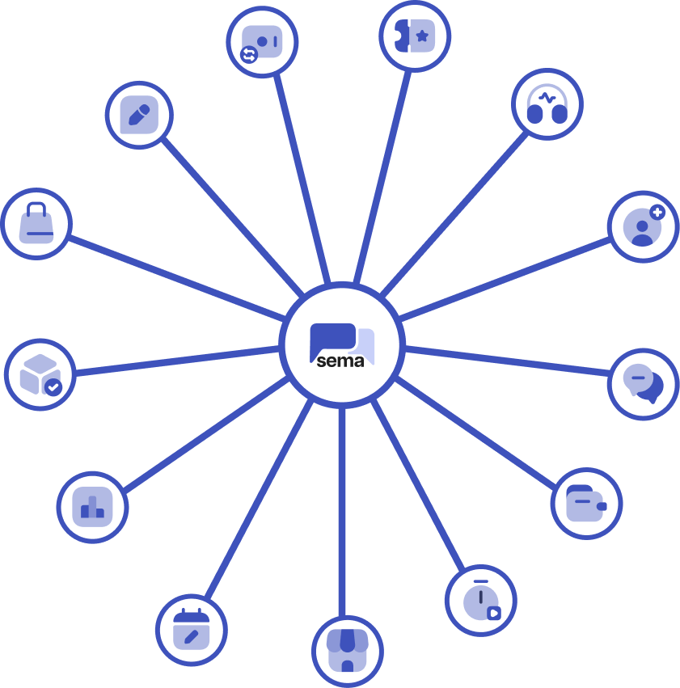
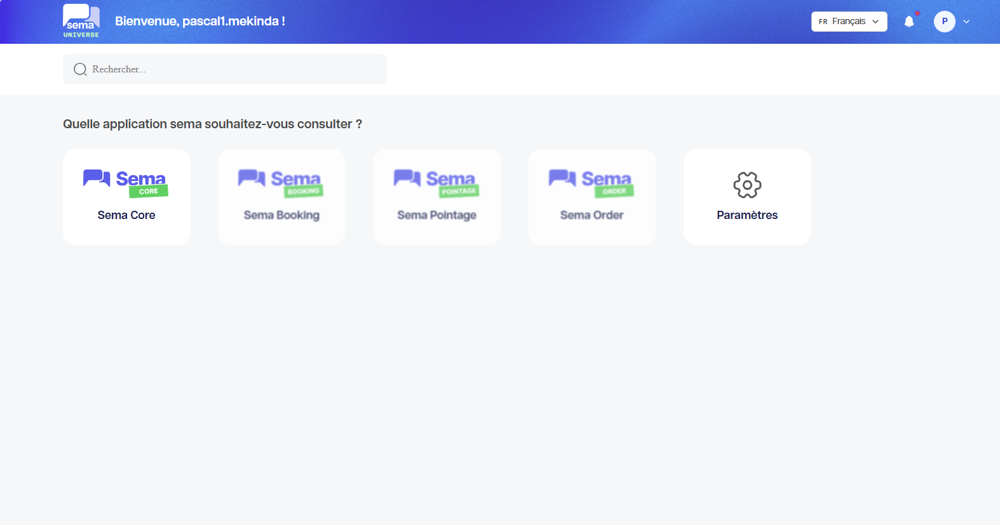

Présentation générale de Sema Universe
======================================

**Sema Universe** est l'écosystème Sema qui regroupe plusieurs produits destinés à accompagner les entreprises dans la gestion de leur relation client, leurs automatisations, leurs réservations, leurs commandes et leur suivi opérationnel.

L'objectif de **Sema Universe** est de proposer un environnement unique où les équipes peuvent communiquer avec leurs clients, automatiser des parcours, suivre les activités et exploiter les données générées par leurs opérations.

À quoi sert Sema Universe ?
--------------------------

Sema Universe permet de :

- Centraliser les produits Sema dans un même écosystème ;
- Accéder à Sema Core pour gérer les conversations, les scénarios, les flow et les tableaux de bord ;
- Utiliser Sema Booking pour les réservations et rendez-vous ;
- Utiliser Sema Orders pour le suivi des commandes ;
- Utiliser Sema Pointage pour le suivi de présence et les rapports de pointage ;
- Donner aux utilisateurs un accès adapté à leur rôle ;
- Suivre les activités et les performances depuis des tableaux de bord.

Produits de Sema Universe
-------------------------

**1. Sema Core**

Sema Core est le produit principal pour la relation client automatisée. Il couvre les conversations, le chatbot, le Scenario Builder, le Flow Builder, les contacts et le tableau de bord.

**2. Sema Booking**

Sema Booking sert à gérer les réservations, rendez-vous, disponibilités et demandes liées à la planification.

**3. Sema Orders**

Sema Orders sert à suivre les commandes, les statuts, les informations client et les opérations commerciales associées.

**4. Sema Pointage**

Sema Pointage sert à suivre les présences, les employés, les sites, les horaires, les absences et les rapports de pointage.

Rôles courants
--------------

Les droits disponibles peuvent varier selon votre organisation. Les rôles les plus fréquents sont :

**1. Administrateur**

L'administrateur configure l'espace de travail, les accès utilisateurs, les intégrations, les paramètres de compte et les éléments utilisés par les autres équipes.

.. 2. Responsable marketing ou relation client
.. Ce profil crée les campagnes, prépare les messages, suit les conversations et analyse les performances dans Sema Core.

**2. Opérateur ou agent**

L'agent traite les conversations, répond aux clients lors des interactions.

.. 4. Responsable opérationnel
.. Ce profil suit les réservations, commandes, présences ou rapports selon les produits activés dans Sema Universe.

Bon à savoir
------------

.. tip::

   Si vous ne voyez pas un produit ou un module décrit dans cette documentation, cela peut venir de votre rôle, des permissions de votre compte ou du paramétrage de votre espace de travail.
   Les différents rôles et permissions sont crées par les administrateurs de votre organisation. Si vous pensez devoir accéder à un produit ou module spécifique, contactez votre administrateur pour vérifier vos droits d'accès.