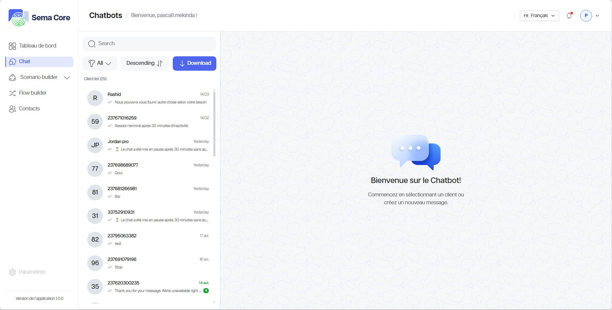
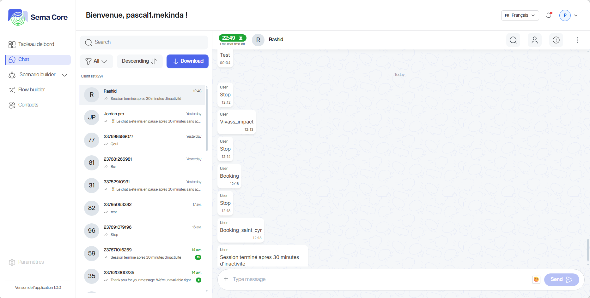
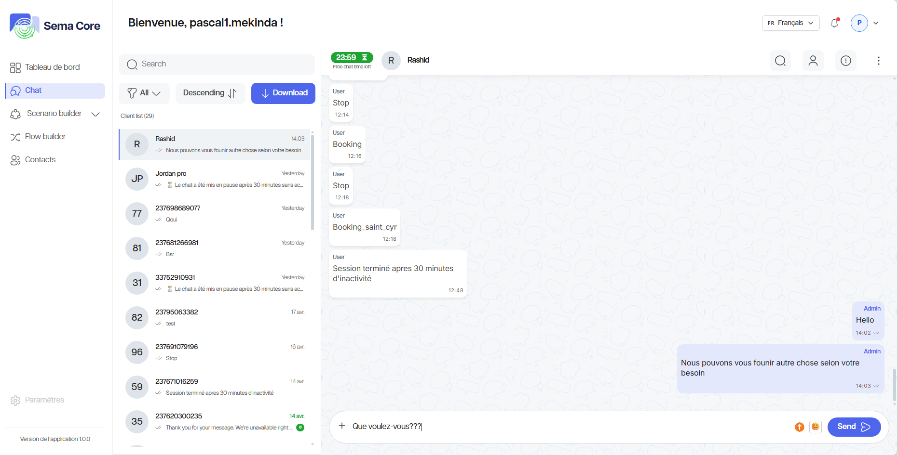
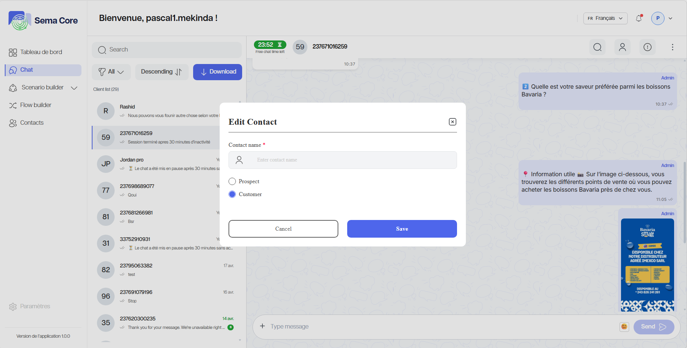
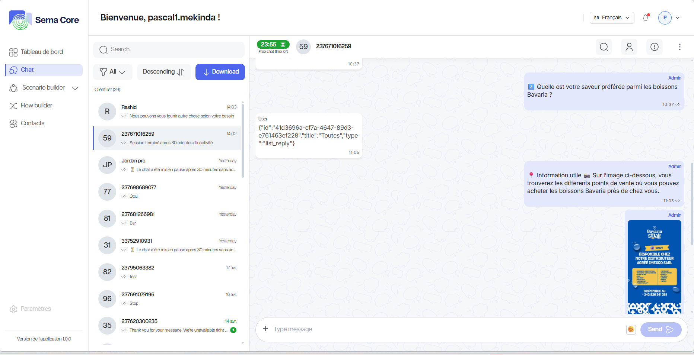

Chat et conversations
========================

Le module **Chat** permet de suivre les échanges entre les clients et le chatbot. Il sert à consulter les conversations, vérifier les réponses automatisées et reprendre la main lorsqu'une intervention humaine est nécessaire.

Objectif du module
------------------

Le module Chat permet de :

- Consulter les conversations entrantes ;
- Suivre le statut d'un échange ;
- Répondre manuellement si nécessaire ;
- Visualiser les informations d'un contact ;
- Comprendre quel scénario ou flow a été déclenché ;
- Contrôler la qualité de l'expérience client.
- Identifier les points d'amélioration des scénarios.
- Analyser les questions fréquentes pour enrichir le chatbot.

Étape 1 — Ouvrir les conversations
----------------------------------

**1.** Connectez-vous à Sema Core.

**2.** Dans le menu, ouvrez **Chat**.

**3.** Vérifiez la liste des conversations.

Étape 2 — Lire une conversation
-------------------------------

**1.** Cliquez sur une conversation dans la liste.

**2.** Consultez les messages envoyés par le client.

**3.** Consultez les réponses envoyées par le chatbot.

**4.** Vérifiez les dates et heures des messages.

**5.** Identifiez si la conversation est toujours active.

Étape 3 — Répondre manuellement
-------------------------------

Si votre rôle l'autorise, vous pouvez reprendre une conversation.

**1.** Ouvrez la conversation.

**2.** Cliquez dans la zone  de réponse.

**3.** Rédigez le message.

**4.** Relisez le contenu.

**5.** Cliquez sur **Envoyer**.

**6.** Vérifiez que le message apparaît dans l'historique.

Étape 4 — Consulter les informations du contact ou modifier un contact
----------------------------------------------------------------------

Dans une conversation, un panneau peut afficher les informations du contact.

Vérifiez notamment :

- Le nom ;
- Le numéro ;
- Les informations enregistrées ;
- Le type de contact (client, prospect, etc.) ;
- Les tags associés.

Étape 5 — Comprendre l'automatisation déclenchée
------------------------------------------------

Une conversation peut être alimentée par un scénario ou un flow.

Pour analyser l'origine d'une réponse :

**1.** Repérez les messages automatisés.

**2.** Vérifiez le nom du scénario ou du flow.

**3.** Notez le moment où l'utilisateur est sorti du parcours automatisé.

**4.** Ouvrez le Scenario Builder si vous devez corriger la logique.

Bonnes pratiques
----------------

**1.** Répondez rapidement aux conversations qui nécessitent une intervention humaine.

**2.** Utilisez un ton clair et cohérent avec la marque.

**3.** Ne modifiez pas un scénario en production sans test préalable.

**4.** Notez les questions fréquentes pour améliorer le chatbot.

**5.** Vérifiez régulièrement les conversations bloquées ou non résolues.

Bon à savoir
------------

.. tip::

   Les conversations sont une source précieuse pour améliorer les scénarios. Lorsqu'une même question revient souvent, ajoutez un nœud ou une branche dédiée dans le Scenario Builder.
