Scenario Builder
================

Le **Scenario Builder** est l'éditeur visuel qui permet de construire les parcours de conversation du chatbot. Il fonctionne avec des nœuds reliés entre eux.

Objectif du module
------------------

Le Scenario Builder permet de :

- Poser des questions aux utilisateurs ;
- Envoyer des messages automatiques ;
- Gérer des boutons, listes et redirections ;
- Créer des conditions ;
- Appeler des API ;
- Afficher des produits ;
- Sauvegarder des réponses dans des variables ;
- Déclencher des flow WhatsApp ou des modèles.
- Organiser les étapes d'un scénario de manière visuelle.
- Faciliter la création et la modification des scénarios sans coder.
- Enregistrer les réponses des utilisateurs pour personnaliser les parcours.

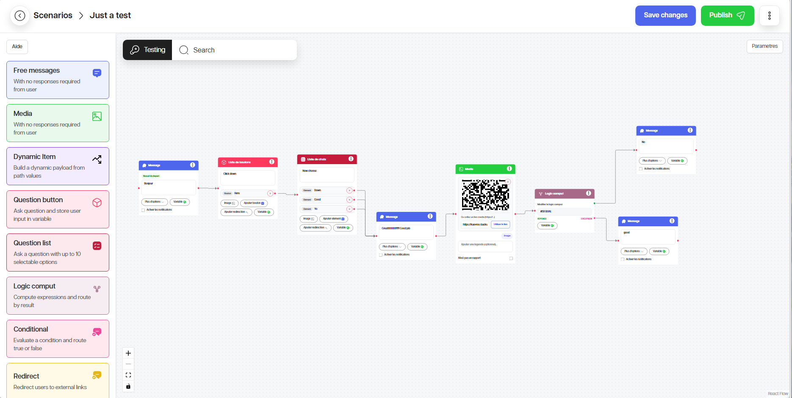

Étape 1 — Ouvrir le Scenario Builder
--------------------------------------

**1.** Dans le menu, ouvrez **Scenario Builder**.

**2.** Cliquez sur **Scenario**.

**3.** Ouvrez un scénario existant, Importer un scénario au format JSON ou cliquez sur **Créer**.

**4.** Attendez le chargement du canevas.

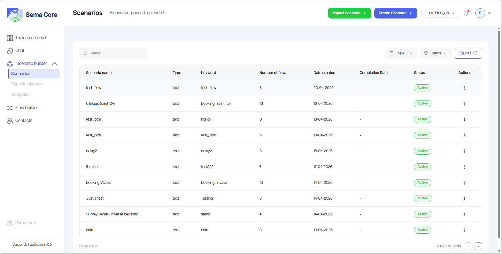

Étape 2 — Comprendre le canevas
-------------------------------

Le canevas est l'espace de travail où les nœuds sont placés et reliés.

Les éléments importants sont :

- **Bibliothèque de nœuds** : liste des nœuds disponibles ;
- **Canevas** : zone où vous construisez le parcours ;
- **Connecteurs** : points de sortie et d'entrée entre les nœuds ;
- **Actions du nœud** : édition, duplication, suppression ou configuration ;
- **Bouton sauvegarder** : enregistre les modifications.
- **Bouton publier** : rend le scénario actif pour les utilisateurs.
- **Zoom et navigation** : outils pour mieux visualiser le canevas.

Etape 3 — Créer un scénario 
---------------------------
**1.** Cliquez sur **Créer un scénario**.

**2.** Donnez un nom clair au scénario.

**3.** Donnez le mot clé de déclenchement du scénario.

**4.** Definir le canal de déclenchement du scenario (WhatsApp, SMS, Web, etc.)

**5.** Donnez le message de secours qui sera envoyé si le scénario est déclenché mais que le chatbot rencontre une erreur.

**6.** Donnez une description du scénario pour faciliter la compréhension de son objectif et de son fonctionnement.

**7.** Définir si le scénario sera celui par défaux sur le numéro de téléphone.

**8.** Enregistrez le scénario.

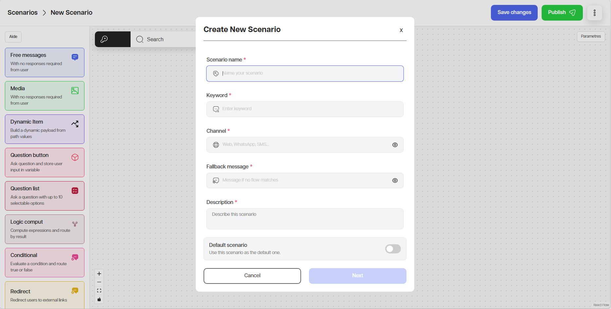

Étape 4 — Ajouter un nœud
-------------------------

**1.** Repérez le type de nœud dans le panneau de gauche.

**2.** Cliquez sur le nœud ou glissez-le vers le canevas.

**3.** Placez-le à l'endroit souhaité.

**4.** Configurez ses champs.

**5.** Reliez-le au nœud précédent S'il y en a.

**6.** Définir si le nœud est un point de départ ou pas.

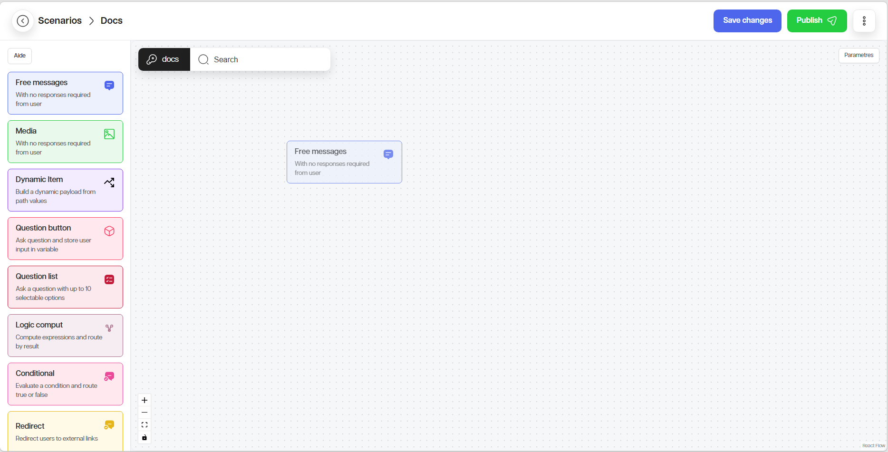

Étape 5 — Relier deux nœuds
---------------------------

**1.** Repérez le point de sortie du premier nœud.

**2.** Cliquez ou glissez depuis ce point de sortie.

**3.** Reliez-le au point d'entrée du nœud suivant.

**4.** Vérifiez que la connexion est visible.

**5.** Si un point reste rouge, vérifiez qu'une connexion obligatoire manque.

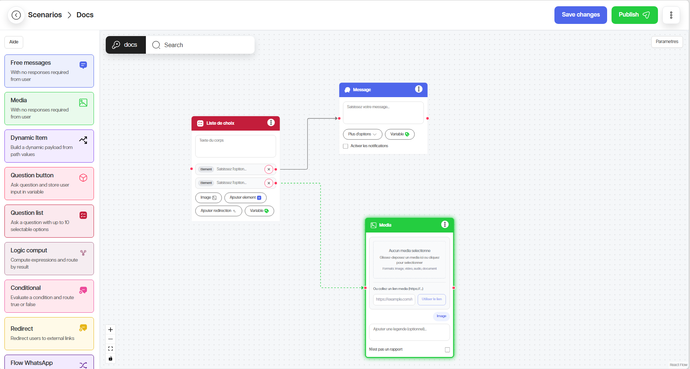

Famille de nœuds 1 — Nœuds de base
-------------------------

**A.** **Question**

Le nœud **Question** permet de demander une information à l'utilisateur et de sauvegarder sa réponse.

Types fréquents :

- **Button** : l'utilisateur choisit parmi quelques boutons ;
- **List** : l'utilisateur choisit dans une liste.

Utilisation :

**1.** Ajoutez un nœud Question.

**2.** Saisissez le texte de la question.

**3.** Choisissez le type de réponse.

**4.** Ajoutez les boutons ou options si nécessaire.

**5.** Cliquez sur ``@Variable`` et la définir pour enregistrer la réponse de l'utilisateur.

**6.** Connectez les sorties vers les étapes suivantes.

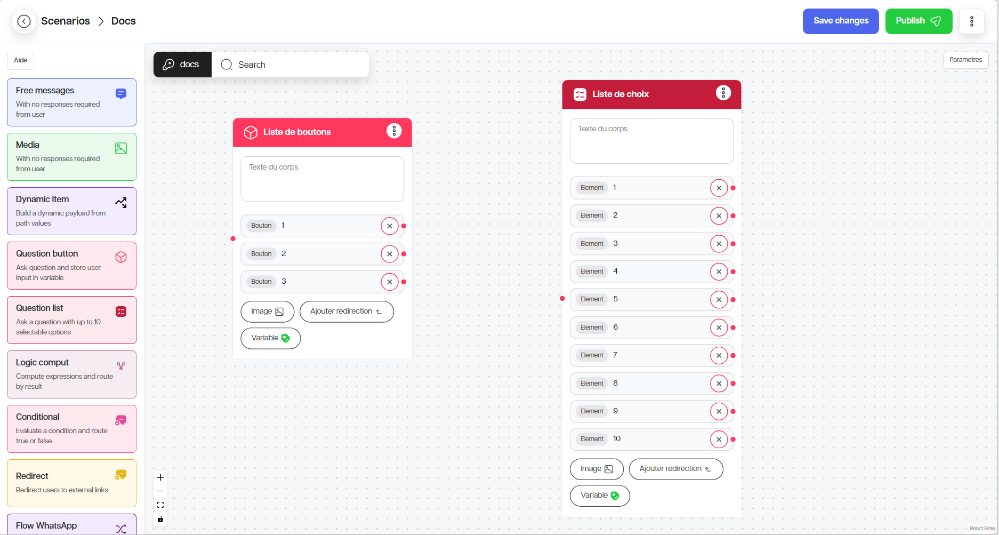

**B.** **Message**

Le nœud **Message** envoie une information sans forcement attendre de réponse. Si vous souhaitez enregistrer la réponse de l'utilisateur, définissez une variable.

Utilisation :

**1.** Ajoutez un nœud Message.

**2.** Saisissez le contenu du message.

**3.** Définissez une variable si nécessaire.

**4.** Activez les options avancées (notifications, n'est pas de type date, etc. ) uniquement si elles sont utiles.

**5.** Connectez le nœud à l'étape suivante.

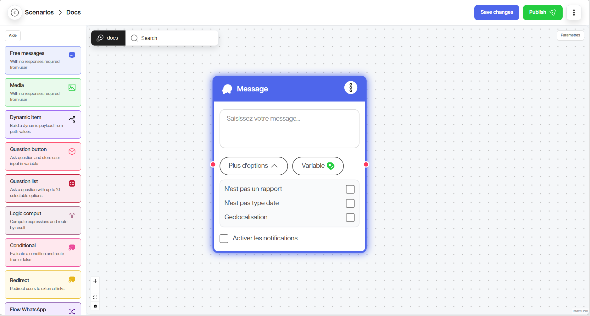

**C.** **Redirection**

Le nœud **Redirection** envoie l'utilisateur vers un lien externe.

Utilisation :

**1.** Ajoutez un nœud Redirection.

**2.** Renseignez le libellé du bouton.

**3.** Ajoutez le texte explicatif.

**4.** Renseignez l'URL.

**5.** Testez le lien avant publication.

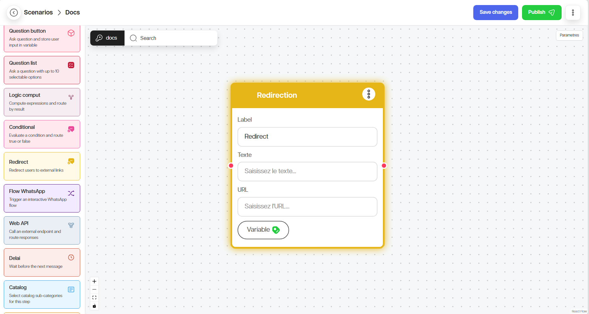

**D.** **Condition**

Le nœud **Condition** sépare le parcours selon une règle logique.

Utilisation :

**1.** Ajoutez un nœud Condition.

**2.** Cliquez sur la configuration de condition.

**3.** Choisissez l'opérateur.

**4.** Saisissez l'expression logique.

**5.** Connectez la sortie **Vrai**.

**6.** Connectez la sortie **Faux**.

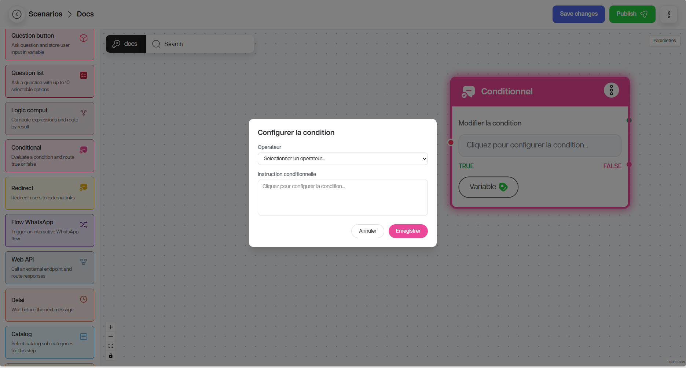

Famille de nœuds 2 — Nœuds avec Options
-------------------

.. Famille 2 — Options (continued)
.. These nodes manage user subscriptions to chat channels

.. S'abonner au chat
.. -----------------

.. Ce nœud inscrit l'utilisateur au canal de conversation afin qu'il puisse recevoir les prochains messages.
..
.. Se désabonner du chat
.. ---------------------
..
.. Ce nœud retire l'utilisateur du canal de conversation. Utilisez-le pour les parcours de préférence ou de désinscription.

**A.** **Délai d'attente**

Le nœud **Délai d'attente** pause le parcours pendant une durée définie.

Utilisation :

**1.** Ajoutez le nœud Délai.

**2.** Renseignez la durée en millisecondes.

**3.** Connectez la suite du parcours.

Exemple : ``3000`` correspond à 3 secondes.

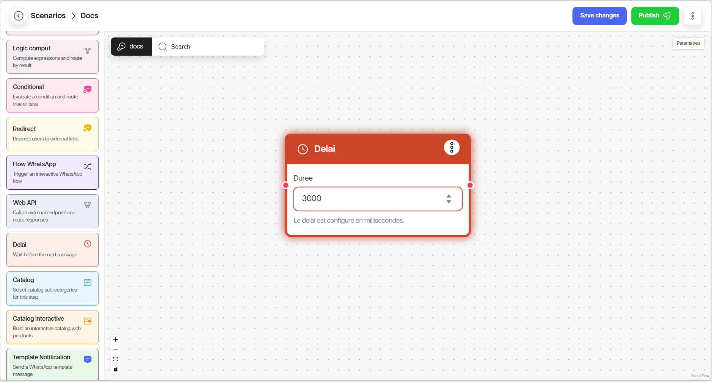

**B.** **Catalogue Interactif**

Ce nœud affiche un catalogue interactif avec des sections.

Utilisation :

**1.** Ajoutez le nœud Catalog Interactive.

**2.** Renseignez l'en-tête.

**3.** Renseignez le pied de page si nécessaire.

**4.** Ajoutez le corps du texte si nécessaire.

**5.** Créez les sections.

**6.** Sélectionnez les produits du catalogue.

**7.** Ajoutez un texte de bas de page si nécessaire.

**8.** Enregistrez la sélection dans une variable.

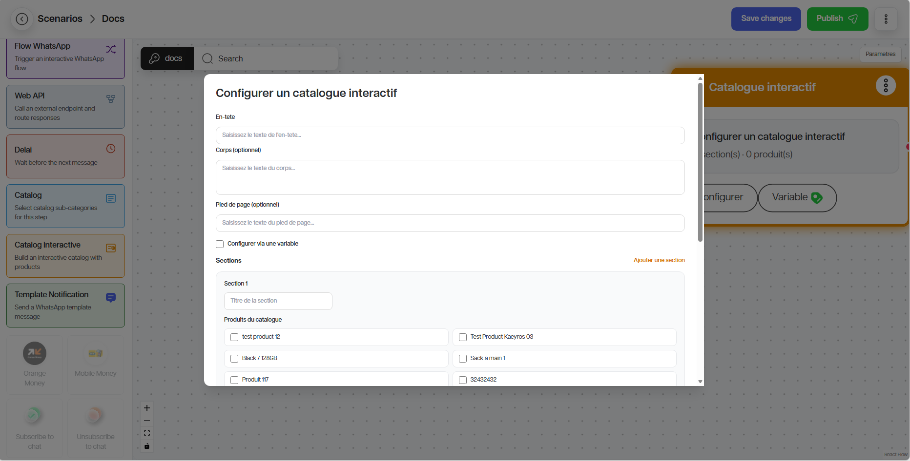

**C.** **Catalogue**

Le nœud **Catalogue** affiche un ensemble de produits.

Utilisation :

**1.** Ajoutez le nœud Catalogue.

**2.** Cliquez sur **Ajouter une sous-catégorie**.

**3.** Sélectionnez les catégories ou produits.

**4.** Enregistrez la sélection avec ``@Variable``.

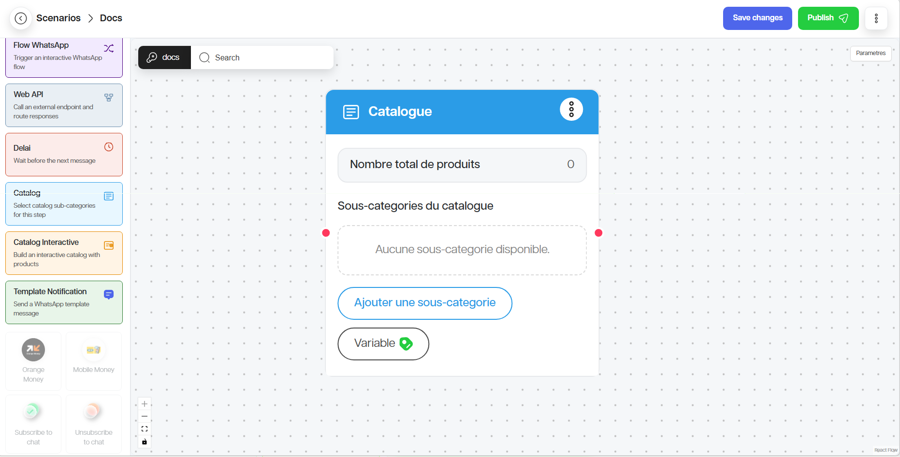

.. Produit unique

.. Le nœud **Produit unique** affiche un seul produit. Utilisez-le pour recommander ou confirmer un produit précis.

Famille de nœuds 3 — Nœuds avec Intégrations
------------------------

**A.** **Web API**

Le nœud **Web API** permet d'appeler un service externe.
Vous pouvez choisir de configurer l'API avec un JSON complet ou un via l'éditeur par champ.

**Utilisation via l'éditeur par champ :**

**1.** Ajoutez le nœud Web API.

**2.** Cliquez sur **Configurer API**.

**3.** Choisissez l'option Éditeur par champ.

**4.** Choisissez la méthode : GET, POST, PUT, PATCH ou DELETE.

**5.** Renseignez l'URL.

**6.** Ajoutez les en-têtes si nécessaire.

**7.** Ajoutez le corps de la requête lorsque cela est nécessaire.

**8.** Ajoutez les paramètres de requête si nécessaire.

**9.** Enregistrez la réponse dans une variable.

**10.** Testez le scénario avec des données réelles.

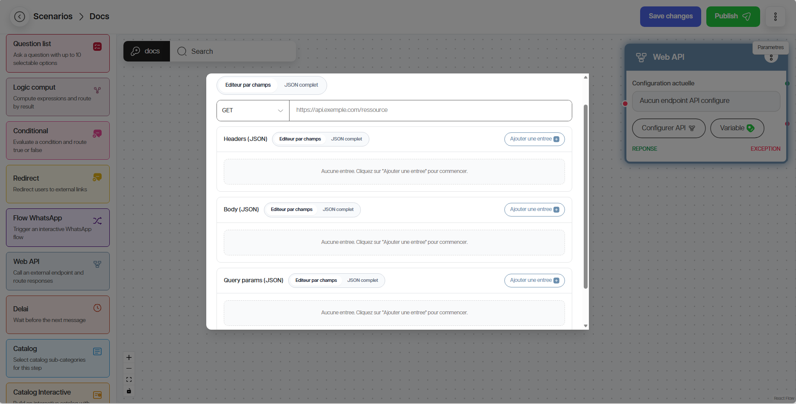

**Utilisation via JSON complet :**

**1.** Ajoutez le nœud Web API.

**2.** Cliquez sur **Configurer API**.

**3.** Choisissez l'option JSON complet.

**4.** Saisissez la requête complète au format JSON.

**5.** Testez le scénario avec des données réelles.

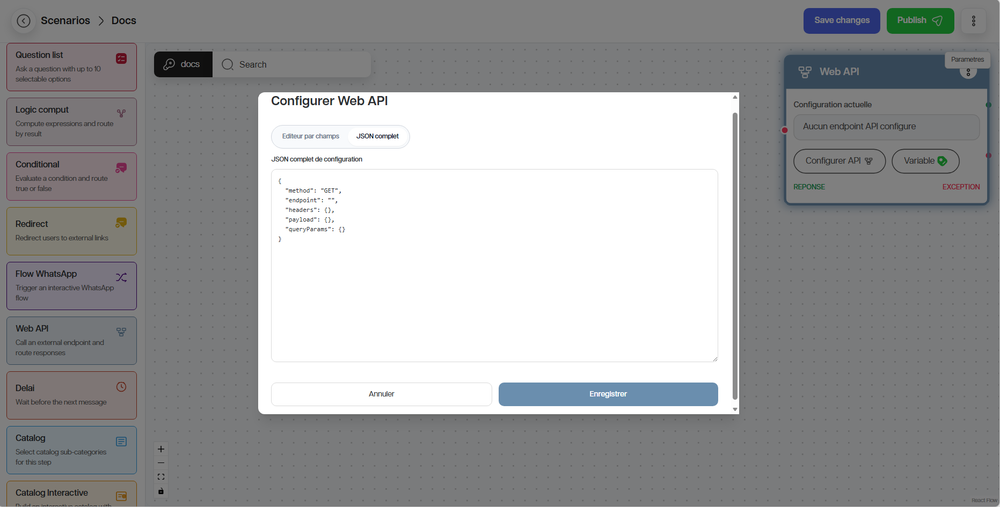

**B.** **Dynamic Items**

Le nœud **Dynamic Items** affiche une liste dynamique à partir d'une donnée variable ou d'une réponse API.

Utilisation :

**1.** Ajoutez le nœud Dynamic Items.

**2.** Renseignez le texte du message.

**3.** Renseignez le titre de la liste des élements à afficher.

**4.** Renseignez l'ID de la variable ou de la réponse API qui contient les éléments à afficher.

**5.** Renseignez les données

**6.** Définir le format d'affichage des éléments (``Afficher en liste ou afficher en concaténation``).

**7.** Enregistrez la sélection avec ``@Variable``.

**8.** Connectez la suite du parcours.

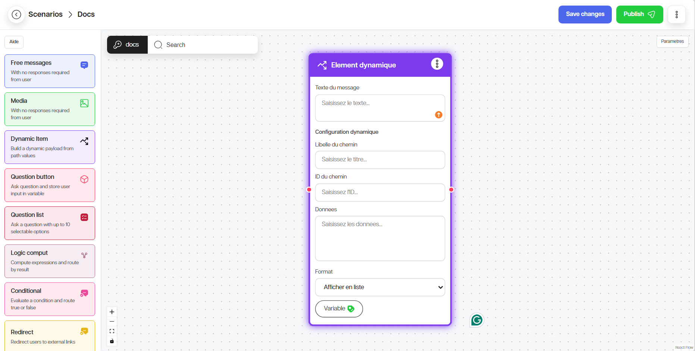

**C.** **Logic Compute**

Le nœud **Logic Compute** calcule ou évalue une expression. Il est utile pour transformer une valeur ou appliquer une règle avant une condition.

Utilisation :

**1.** Ajoutez le nœud Logic Compute.

**2.** Selectionnez l'opérateur logique.

**3** Saisissez l'expression logique .

**4.** Enregistrez le résultat dans une variable.

**5.** Connectez la suite du parcours.

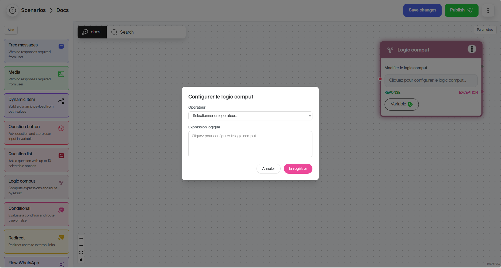

**D.** **Notification par modèle**

Ce nœud envoie un modèle approuvé. Il est souvent utilisé pour des messages WhatsApp structurés.

Utilisation :

**1.** Ajoutez le nœud Notification par modèle.

**2.** Cliquez sur **Configurer le template**.

**3.** Définissez le nom du template.

**4.** Renseignez le numéro de téléphone du destinataire.

**5.** Renseignez le code de la langue.

**6.** Ajoutez les variables de personnalisation si nécessaire (paramètres d'en-tête, paramètres de corps, et les boutons).

**7.** Enregistrez et testez le scénario.

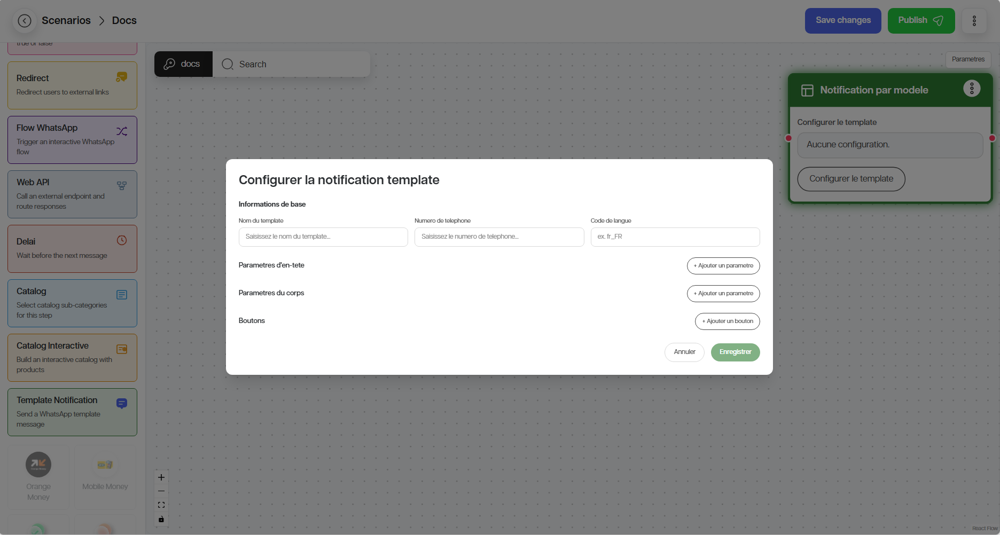

**E.** **Média**

Ces nœuds permettent d'envoyer une image, une vidéo, un audio ou un document, avec ou sans légende.

Utilisation :

**1.** Ajoutez le nœud Média.

**2.** Renseignez l'URL ou téléchargez le média (image, vidéo, audio, document).

**3.** Ajoutez une légende si nécessaire.

**4.** Enregistrez et testez le scénario.

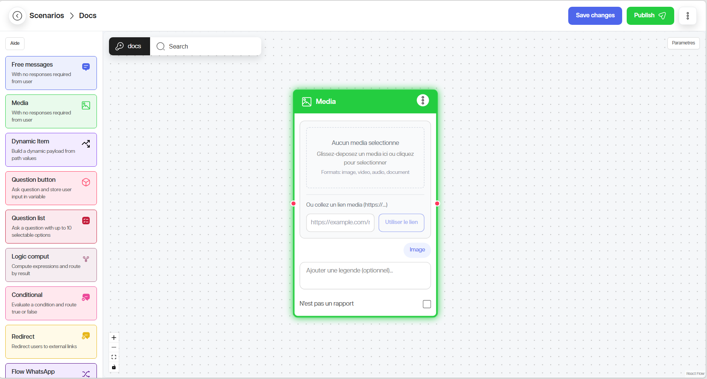

.. Mobile Money
... ----------------
.. Ce nœud ajoute une étape de paiement mobile si l'intégration est activée dans votre espace.

**F.** **Flow WhatsApp**

Ce nœud lance un flow WhatsApp natif.

Champs fréquents :

- En-tête ;
- Pied de page ;
- Corps ;
- Flow Token ;
- Flow ID ;
- Flow CTA ;
- Screen ;
- Payload data ;
- ``@Variable`` pour récupérer les données soumises.

Utilisation :

**1.** Ajoutez le nœud Flow WhatsApp.

**2.** Renseignez l'en-tête.

**3** Renseignez le corps du message.

**4.** Renseignez le pied de page.

**5.** Renseignez le Flow token.

**6.** Renseignez le Flow ID.

**7.** Renseignez le Flow CTA.

**8.** Renseignez les données de payload si nécessaire.

**9.** Renseignez l'écran de destination après le flow si nécessaire.

**10.** Enregistrez les données retournées dans une variable.

**11.** Connectez la suite du parcours (Web API).

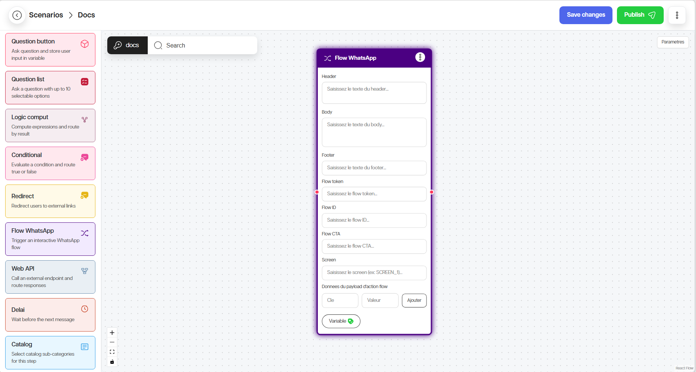

Variables
---------

Une variable est une donnée enregistrée pendant la conversation. Elle peut contenir des informations saisies par l'utilisateur, des réponses d'API, ou des résultats de conditions.

Exemples :

- Nom du client ;
- Choix d'un bouton ;
- Produit sélectionné ;
- Réponse API ;
- Résultat d'une condition.

Pour sauvegarder une variable :

**1.** Ouvrez le nœud concerné.

**2.** Cliquez sur ``@Variable``.

**3.** Donnez un nom clair à la variable.

**4.** Enregistrez.

**5.** Réutilisez la variable dans les messages, conditions ou API.

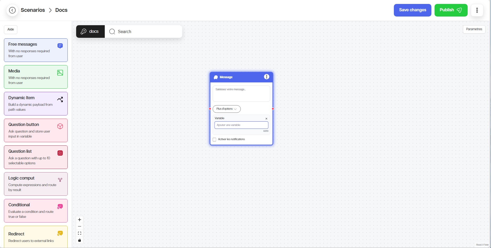

Bonnes pratiques
----------------
.. important:: **1.** Commencez toujours par un message clair.

   **2.** Donnez des noms simples aux variables.

   **3.** Connectez toutes les sorties obligatoires.

   **4.** Testez le scénario avant publication.

   **5.** Évitez les textes trop longs sur mobile.

   **6.** Gardez une logique simple et lisible.

Liste de contrôle avant publication
-----------------------------------

- Tous les nœuds sont-ils connectés ?
- Les variables sont-elles correctement nommées ?
- Les conditions ont-elles une sortie Vrai et Faux ?
- Les liens externes fonctionnent-ils ?
- Les API retournent-elles le résultat attendu ?
- Le parcours a-t-il été testé avec un utilisateur de test ?
